Hello

This blog captures my journey through four transformative years at Amrita University's Amritapuri campus during my undergraduate studies. I write this both as a chronicle of the experiences that shaped me and as a tribute to my 18-year-old self who first stepped onto this campus, as well as to the remarkable individuals I've met along the way.

I began writing these reflections during my final months at the university, looking back with the perspective that comes from maturity and distance. What you'll read here represents the pivotal moments that significantly influenced my development, from a high school graduate with ambitious dreams to a more complete and self-aware individual ready to embark on the next chapter. With this blog, I intend to offer readers — both those who know me and new ones who discover it — insights into my personal journey throughout these formative college years.

It's worth noting that this narrative isn't exhaustive. There are experiences I've chosen not to include as they feel too personal for public sharing or difficult to articulate. My future self might question these omissions. There are also nuances, contexts, and situational factors that either escape my memory or cannot be fully conveyed in this blog without maintaining its brevity.

The inspiration for writing this came from reading Aswin's [College Blog](https://aswinc.blog/blog/college/), which beautifully chronicled his own university experience. There are many parallels and differences in our journeys and I encourage you to read his blog if you haven't already.

The first section of this blog highlights significant experiences, organised chronologically by academic year, followed by sections that summarise my broader reflections and realisations gained throughout this period. Feel free to skip to the later sections if you're more interested in the takeaways.

## The Chapters

### First Year (2021-22)

The induction program and first semester of classes started in August 2021 and were held online as the COVID lockdowns were not completely lifted. I remember having my JEE Advanced[1] the day before the start of the Amrita induction program, and hoping that the induction program would be the only part of Amrita that I'd have to attend. However, not being sure about wanting to pursue a research path and being impressed by the various clubs and the passion of the senior members with whom I was in contact, I gave up my spot at a national research institute and decided to continue at Amrita.

During my first semester, I mostly kept to myself, with online classes limiting interaction with my batchmates. Most of my day was spent attending the monotonous online classes, going to the gym, playing with my dog, and working on the tasks to get into amFOSS, the technical club in my college focusing on open-source contributions. I had made a few friends and acquaintances that semester, but my interaction with the college folks was mostly limited to them. I believe this was partially due to the few years of lockdown and solitude which caused me to withdraw from social interactions.

When reading the blog, you'll notice that I make a lot of references to amFOSS and many of the incidents I mention are related to it. amFOSS, along with its sister club, bi0s, are two high-intensity student-run university clubs with a long legacy. The members of these clubs stay back in the lab and work after classes every day, show consistent progress and handle the responsibilities of managing the club. In return, we get mentorship from the senior members, connections and a community of like-minded and motivated people. Later on in my college life too, the projects I worked on and the people I worked with were mostly the seniors or faculty members I met via the club, and so was my main friends group. Considering all this, a major part of my college life revolved around the club and it has left its influence on me.

The second semester was held offline and we moved to the campus. For all the boys who joined the Amritapuri campus, the accommodation for the first year of college is at the Amritapuri ashram, which is 2 kilometers away from the college. The ashram is situated in a picturesque and quiet Kerala fishing village with the Arabian Sea on one side and backwaters on the other. Walking along the coast in the evening, you'll see fishermen sitting in circles playing cards, the village children playing football with fallen branches dug into the sand as goalposts, inhabitants from the ashram meditating or doing yoga and college students roaming around and having a good time. 

The Ashram is a completely different environment from what most students from urban backgrounds are used to. People from all corners of the world come here to lead a life of devotion and engage in *seva*[2] daily. The general atmosphere in the ashram is spiritual and calm, which some of its inhabitants attribute to the grace of and proximity to Mata Amritanandamayi (affectionately referred to as Amma by everyone in the ashram and college). 

During my first week at the ashram, I remember feeling restless while waiting at the checkout counter of one of the stores inside the ashram. Two elderly ladies were manning the register, writing down the price of each item on paper before using a calculator to get the final amount. Being used to the quick and efficient checkouts back home, I stood anxiously, concerned about holding up the line. What struck me was that neither these ladies nor anyone waiting behind me seemed to be in any hurry. I was the only one feeling the pressure of time — a clear sign of how different the pace of life was here. 

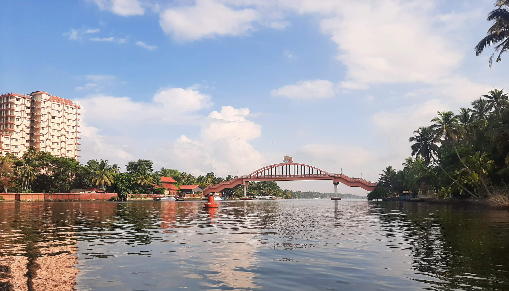

    <figcaption><i>The Amrita Setu Bridge that connects the ashram and college which we had to cross every day in our first year to get to college</i></figcaption>

After reaching the campus, I met the people from my class and club, made friends with a few and started hanging out with them. Everyone was eager to meet each other and was very approachable during this time. There was an air of excitement and hope in all of us. This must be the case with all freshman students when joining college. Everyone is new, at their best behaviour and enthusiastic about getting to know others and finding their own set of people. 

During this time, some of my classmates would visit my room and strike up a conversation and check up on me every day and generally express interest in being friends. Although I was initially apprehensive about forming close friendships after two years of near isolation due to COVID, many of these people persisted in their efforts to connect. Eventually, I joined them for course projects, and they, over time, became some of my closest friends on campus.  

Another thing worth mentioning was the evident lack of malice in the intentions of my batchmates. This was in contrast to my experience after 10th grade, when I moved from the UAE, where students were generally approachable and kind, to a school in India, where I found the social environment less welcoming. I believe this genuine goodwill among students is distinctive to this college environment and the people it attracts, or maybe I was just lucky to have met a good set of people.

I maintained a high CGPA of 9+ during my first year, largely because my prior programming experience made the assignments and projects relatively straightforward. Since I aimed for an 8.5 CGPA at graduation, these high initial grades served as a crucial buffer for the lower grades I got in later semesters. This strategy proved valuable, and I've since advised juniors to put effort into academics for their initial semesters — it gives you the freedom to take risks and explore opportunities later without worrying about your overall GPA.

We also had a few interesting courses that year. The most memorable was "Elements of Computing System (EOC) I & II". In EOC I, we built a computer from scratch by defining connections between logic gates to create simple circuits like binary adders, 1-bit registers, and flip-flops, then progressing to more complex components like ALUs, control units, and memory units. EOC II required us to build an assembler and compiler for a toy language that would run on our designed computer. This involved learning low-level concepts like memory mapping, stacks, heaps, function call stacks, and pointers. Building a computer bottom up gave me a clear understanding of the steps in the translation of high-level code into low-level instructions that get executed by the hardware, which made computers a little less mysterious and much more exciting to work with. For anyone interested, the course is based on the book [Nand to Tetris](https://www.nand2tetris.org/). Although not very relevant to my current work, this was my favourite and the most enjoyable course I had during college.

On an evening this year, a friend from the club invited me and a few others to join him for a hackathon in Thrissur. Despite my initial hesitation due to the hackathon dates clashing with my missed mid-semester examination and a pile of assignment deadlines, I decided to attend. It was our first offline hackathon, and it turned out to be an incredibly memorable experience. The sleepless nights, constant flow of energy drinks and snacks, 3 AM coding sessions, and all the fun games organized made it truly special. Even though we didn't win any prizes, my teammates and I formed a strong bond, staying together as a group throughout the rest of our college years.

### Second Year (2022-23)

This year had me adjusting to college life, its routines and activities. In retrospect, it also feels like the longest and most eventful year. This year marked my transition from being a newcomer in an unfamiliar place and following instructions, to taking ownership of my life and exploring different options. I also made many new friends during the year and became more comfortable with the surroundings and the people around. The food served at the university mess was still unbearable, but I somehow got used to it. Canteen meals and the occasional visits to nearby restaurants were my only respite.

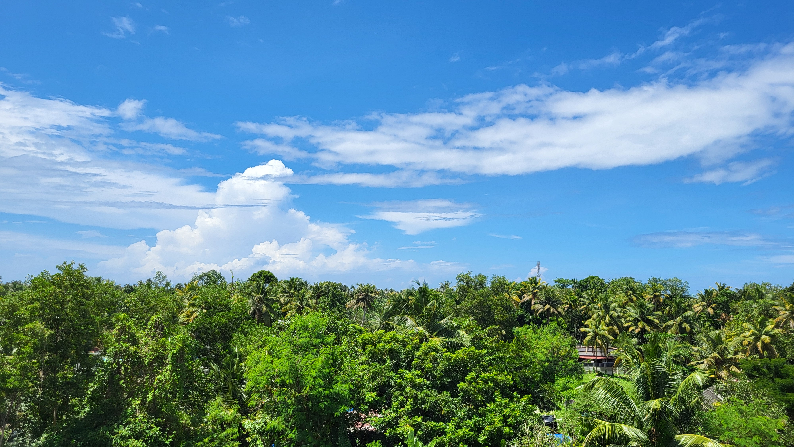

    <figcaption><i>Amritapuri has amazing skies — the hostel terrace being the best place to look at it</i></figcaption>

The social graphs among my batchmates also started to solidify this year, the distinct cliques and circles becoming more defined as people found their tribes — some gravitating toward academics, others toward clubs, sports, or simply shared humor and perspectives. What became apparent over time was that these social structures had both permanence and fluidity. People would forge unexpected connections across group boundaries, some relationships would naturally fade as paths diverged, and individuals would sometimes completely shift their social positioning based on new experiences or changing priorities. Despite these continuous shifts in individual connections, the fundamental structure and identity of each group remained largely unchanged throughout our college experience. These are standard college social dynamics, but they were a constant backdrop to our four years that they deserve a mention.

It was also at the beginning of this year that I started learning Deep Learning. First-year students in the club are generally discouraged from studying AI and are advised to focus on core development skills and explore various domains. Although I initially disagreed with the rule, I now recognise that working in other domains significantly helped me develop strong programming fundamentals. This later made it easier for me to handle the non-AI aspects of projects, which typically consume most of the time in real-world projects. 

Club life also became more hectic. We started taking up more responsibilities, conducted induction program and workshops for the juniors, and also started mentoring them. My batchmates and I started staying in the lab until 11 p.m. most days, after attending classes from 9 a.m. to 5 p.m. The motivation to sustain this lifestyle for many years stemmed from the presence of most of my friend group in the club. Watching them and the seniors work hard every day into the night inspired me as well.  

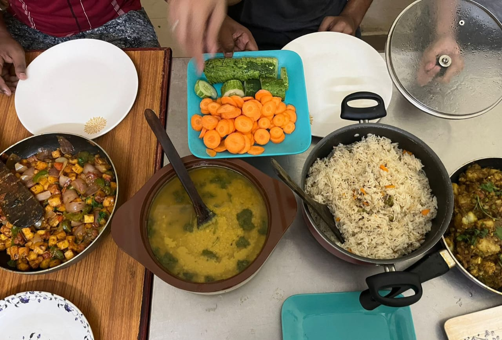  

    <figcaption><i>My friends from Nepal would invite us to join them in the international students' hostel and would cook some of the best food I’ve ever eaten.</i></figcaption>

A few months into the year, I realised my childhood dream had come true — I finally had a friend group just as passionate about programming and tinkering as I was. Despite our diverse backgrounds, what united us was our shared drive to excel and build meaningful things. What struck me most wasn't just their technical brilliance, but also their integrity and drama-free approach to friendship. My clubmates and the seniors I worked with at the club were truly exceptional. These seniors became mentors in many ways, guiding my learning journey, giving nuggets of wisdom and realistic bits of advice that helped me navigate college.

The fourth semester was perhaps the longest and most eventful of my undergraduate years. During this time, Vidyut — the college's multi-fest — was scheduled to take place, and my friend and I had volunteered to organise an event called PixelPlayground. This was in early 2023, shortly after ChatGPT's release but before the LLM boom, when generative AI was still in its early stages and text-to-image models like Stable Diffusion and DALL-E were the most exciting developments in the field. Our concept was ambitious — to create a booth that would introduce visitors to these cutting-edge text-to-image models and demonstrate their capabilities through live generation. We also planned to run a competition where the best AI-generated images would win prizes based on Instagram likes.

The idea had potential, but we quickly discovered that enthusiasm alone doesn't translate to successful event management. As complete novices to organising large-scale events, we found ourselves drowning in logistics we hadn't anticipated, venue coordination, decoration planning, equipment setup, and most critically, sponsor acquisition. What we initially assumed would be straightforward conversations with potential sponsors turned into an exhausting cycle of cold emails and awkward pitches through mutual connections. Despite our technical excitement about the project, we lacked the organisational experience and institutional support needed to navigate the practical challenges.

With minimal guidance from both the club and the Vidyut organising committee, we struggled to develop a coherent execution plan. The reality of event organisation (budgets, timelines, vendor management) hit us hard. After weeks of frustration and mounting pressure, we made the difficult decision to cancel PixelPlayground just days before Vidyut began. My disappointment about the whole ordeal led me to make the below tweet, which was surprisingly well received. Maybe others too had similar experiences.

<blockquote class="twitter-tweet">
I believe it&#39;s too late to add a new event for Vidyut. Should&#39;ve thought of it before <a href="https://t.co/gClsKI9jWo">https://t.co/gClsKI9jWo</a>
&mdash; Gautham Krishnan (@gaushn_) <a href="https://twitter.com/gaushn_/status/1651201080791900160?ref_src=twsrc%5Etfw">April 26, 2023</a></blockquote> 

While juggling Vidyut preparations and the frustrating sponsor hunt, I, along with my clubmates, attended Hackverse4.0, a hackathon organised by NITK Surathkal and Devfolio. I’ve written about the details and experience of attending the hackathon in my previous [blog](https://gauthamk02.github.io/posts/winning-my-first-hackathon/).   
Repeating the important part here, we came first in the hackathon, which gave a huge confidence boost, bragging rights and fun stories to tell. I also consider this my first major college achievement. However, as opposed to the feeling of happiness I used to get during school days after winning something, this time the feeling was that of contentment. This could probably be attributed to the self-imposed pressure for winning a competition, as we hadn’t gotten any major wins until then. 

Something that I had not mentioned in the above blog is how the experience of trying to organize the event for Vidyut possibly helped me win the hackathon. Having searched in depth about the different text-to-image models at the time, I knew the capabilities and use cases of most of the models. This helped me integrate the models effectively into our hackathon project and answer all the doubts and questions of the judges who were impressed by our project.   

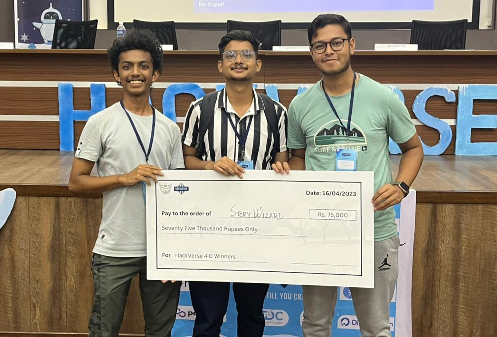

    <figcaption><i>With the winning cheque for Hackverse4.0.</i></figcaption> 

 

Vidyut happened a few weeks later with all the pomp and celebrations. On the days leading up to the event, there was a lot of planning, meetings for the organizers, and a general sense of urgency and rush throughout the campus. You could see the pavilions being constructed, the decorations and lights being hung up, and the sponsor standees coming up in different corners of the campus. There was another event from amFOSS that a few of my batchmates and juniors had put a lot of effort into organising. I spent most of the mornings near the booth helping them while also going around and trying the various food stalls and watching the shows.

It was also on the day before the start of Vidyut that the Google Summer of Code(GSoC) selection results were released. GSoC is an anticipated open-source contribution program that everyone in the club tries to get accepted to. I had applied that year for a project dealing with the application of AI in Deep Space image analysis, but unfortunately didn't get selected. I was not very disappointed as I knew the chances for selection to the project were slim since I was just starting out on learning AI, and there were several other applicants to the same project that I applied to. A few of my friends were selected to contribute to their respective projects. We congratulated them, made posts about their achievements on the club socials, and carried on with Vidyut.

The celebrations died off after the event, and as the coordinating team was busy with the budget works, documentation and preparation of the event certificates, the faculties were busy catching up on the portions.

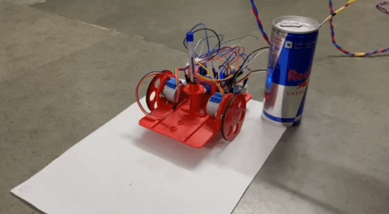

    <figcaption><i>Calibrating the controls of DrawVinci, a 3D printed robot that reproduces computer drawings onto chart paper — our project for the Robotics course. (Redbull for scale)</i></figcaption>

It was around this time that I joined the EUSML project, a Medical-AI research project building AI tools for doctors in detecting pancreatic cancer. Working on the project included writing code that will be reviewed and used by other members of the team. Until then, all the code I wrote was part of personal projects,  which had never gone through a formal review or collaborative feedback process. Getting reviews on the code I wrote drastically improved my code quality in terms of using best practices, writing clean code, and my ability to understand others' code. 

<blockquote class="twitter-tweet">
New programmers, once you&#39;ve got the basics of a framework or techstack down, team up with experienced devs, or contribute to open-source. You&#39;ll learn coding standards, debugging, and more, allowing you to work on larger and more complex projects.
&mdash; Gautham Krishnan (@gaushn_) <a href="https://twitter.com/gaushn_/status/1883389583297311042?ref_src=twsrc%5Etfw">January 26, 2025</a></blockquote> 

For this year, we also had two engaging courses on the epics Mahabharata and Ramayana. The faculty teaching these courses did an excellent job helping us understand the complex narratives, providing critical character analysis, and extracting philosophical wisdom from these ancient texts. I found myself looking forward to these classes and remained attentive throughout. For the course project, my team visited a prominent Sri Ram temple in Kollam, where we created a short documentary about its history and associated mythology, which was uploaded to YouTube. The documentary was well-received in the temple village, garnering many views and positive comments from the locals. Courses like these, along with community service projects like SSR (which I'll discuss in the next section), are unique offerings that distinguish Amrita University and particularly the Amritapuri campus from other technical institutions in India. Although students usually do not give these the same importance as technical subjects, these courses provide valuable opportunities to connect with cultural heritage and make meaningful contributions to the community.  
   
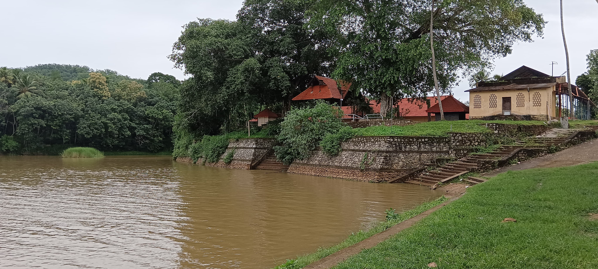  

    <figcaption><i>Vellinaloor Sreerama Swamy Temple, where we shot our documentary.</i></figcaption>

I had also caught COVID sometime this semester, from which I recovered in a week, but a few of the health problems persisted for a while. The remainder of the semester and the following exams were uneventful. But after the exams, a few of my friends and I went on a week-long trip to Chennai and stayed at a friend's place. It was one of the most enjoyable trips I had during college, during which I ate different foods, played a lot of games and most of all, spent some of the best quality time with my mates from college. This year also saw me starting to write blogs and being active on Twitter, two of the ways in which I started maintaining an online presence and putting my thoughts out in the public.

### Third Year (2023-24)

This year started off with a lot of expectations, plans and a big list of things that I wanted to do by the end of the year. The third year is the time when people in the club start getting serious. Everyone tries to get a few achievements under their belt and maybe even have a job in hand before the start of the fourth year. I too went down this path, took up multiple projects, and started applying to different programs, companies and hackathons. I made it to the final interview round of a core AI startup for an internship role, but didn't receive an offer after that. This bothered me for a while, as the internship seemed like the perfect opportunity for me at the time in terms of working on cool new tech, getting good pay and working with a team of engineers and scientists from all around the world. 

My general emotional and physical well-being was also probably at its worst at this time during my entire college life. The project I was working on didn't seem to progress, and I kept getting rejected from all the hackathons and programs I applied to. I also developed a few health complications that made me lose a lot of weight and I was tired throughout the day. These, along with a few personal issues led to a very depressing period.

I tried to compensate by keeping myself occupied by being involved in new projects, engaging more in the club, and maintaining a busy schedule. I realised later that overworking myself was not the appropriate response to any of the problems, but it seemed like the only thing I could do then. Things eventually got better. My health improved after a few consultations with doctors, and I also got a lot of exciting stuff to work on in my projects. 

A few months into this year, I started contributing actively to Deepchem. I worked hard and was able to get significant contributions merged into the repo, which I'm sure contributed to getting selected for GSoC. The EUSML project too began progressing much faster. We tried out different methods, started getting more and better-quality data, and spent a lot of time managing the infrastructure and code. Overall, the team was very excited and I also started taking on more responsibilities in the project. Around this time, I gave my first talk, which was at a monthly FOSSUnited Meetup held in Kochi on the “Transformer Architecture”.

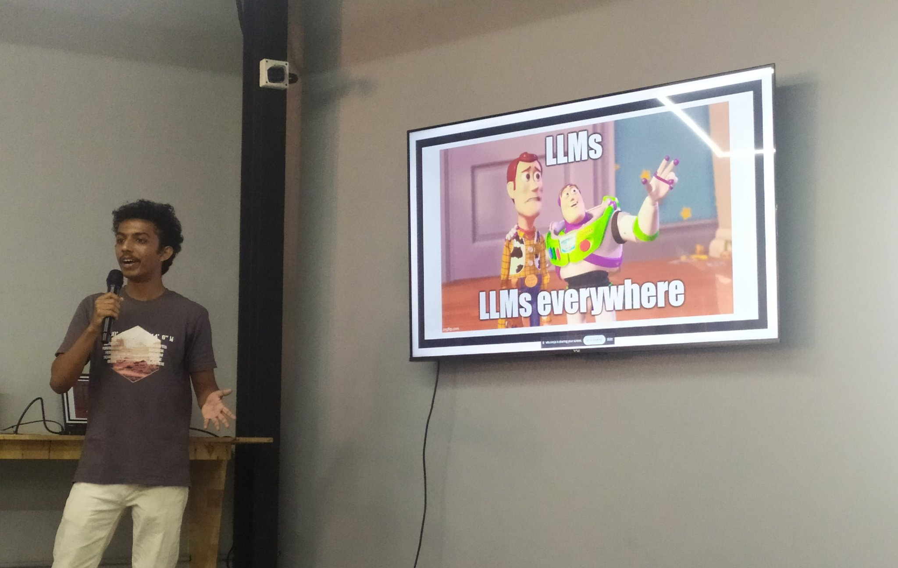 

    <figcaption><i>No talk is complete without a relatable meme to convey the idea</i></figcaption>

The GSoC results were announced in May 2024, and I was selected as a contributor to DeepChem. As part of the program, I got to interact with many interesting people, got be part of an amazing community, and worked on an exciting project — to add support to the library for model compilation, allowing faster training and inference. For those interested, the project report can be found [here](https://forum.deepchem.io/t/project-report-torch-compile-and-pytorch-2-2-0-gsoc-2024/1441).  

Two months before getting GSoC, I had also taken up another opportunity via a senior in the club, which was to be part of the research team of a student club at UCSC and work on a project of theirs. With this, GSoC, EUSML, and the academics, my time was stretched thin, and I was struggling to make meaningful contributions to any of the projects. I naively assumed that, by optimising my time, I would be able to handle all the tasks. Every day during this period, I would go to bed feeling unsatisfied with my work and feeling guilty for not making any progress. This went on for about three weeks, after which I burned out and decided that I had to drop something. I left the UCSC team and decided to concentrate on EUSML and GSoC. The workload of having just these two projects was manageable, and I was able to make significant contributions to them again. Out of this whole situation, I was able to better understand my limits and capabilities. After this, I haven't taken on extra work that I can't handle and was more apprehensive about doing multiple things at once. 

If you're a junior reading this, real growth happens by diving deep into problems rather than skimming the surface. When you fully commit to solving a challenge, you develop technical intuition that can't be gained through tutorials, learn to navigate the messy reality of real-world problems, and connect with others in the same boat. You also build both depth in your core area and breadth across adjacent skills that prove invaluable in unexpected ways later on. This kind of expertise just can't develop through shallow involvement in multiple projects. And of course, overworking isn't a solution to life's problems, it's often another problem in disguise. I'd been given this advice by seniors, but I had to learn it the hard way. Sometimes you just have to experience things yourself for the lessons to truly sink in.

In December of that year, my team conducted our Student Social Responsibility (SSR) project — a mandatory course activity where students take up initiatives to give back to society. While most teams opted for awareness drives or clean-ups, we chose to run a one-day hardware programming workshop for middle school students. This project was especially meaningful to me because my own journey into hardware programming began with a similar workshop in 8th grade, which introduced me to the ecosystem of hobby boards and sensors that later proved invaluable for college projects like the DrawVinci robot. Coming to a full circle by conducting a similar workshop for young students fulfilled a long-held dream — I wanted to spark in them the same passion that had shaped my path. Seeing the enthusiasm of the students attending the workshop made me feel I had completed a personal mission.

As the semester progressed, I went on some fun trips with my friends and visited a few places. Towards the end of the third year, I also consistently started going to the gym and started seeing the results after a few weeks. In a few months, friends and acquaintances started commenting on my progress, which is one of the best validations that someone who goes to the gym can get. Maintaining a good diet with the mess food was hard and took a lot of effort, but with enough determination and money on protein supplements, I pulled it off.  

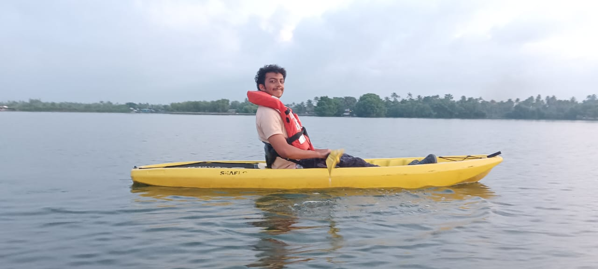

    <figcaption><i>Me experiencing the joy in kayaking and the beauty of Kerala backwaters</i></figcaption>

This year could be summarised as a transitional period from naive enthusiasm to better-grounded self-awareness. I entered with grand ambitions and a lengthy to-do list, but by year's end, I found myself less concerned with checking items off a bucket list and more focused on sustainable progress in areas that truly mattered to me. This year was also transitional for my work and its impacts. Until then, I had primarily focused on building personal projects — code that only I would use and benefit from. Through my contributions to DeepChem and EUSML, my work began reaching beyond just my own portfolio. My code was being reviewed, merged, and utilised by other developers and researchers. It was, however small, having an impact on the world. This shift from solitary tinkering to collaborative contribution brought a different kind of satisfaction and purpose to my programming efforts.

### Fourth Year (2024-25)

I started the fourth year by attending GitHub Field Day in Hyderabad, which is an yearly meetup/unconference for student community leaders in India. The event was held at the Microsoft office in Hyderabad and had around 50 attendees from all over the country. These people were all leaders in their campus tech communities and at least half of them were GDSC leads wearing their GDSC lead jackets, which had no shortage of pockets and compartments. Every lead I talked to pulled their pens out of a different compartment in their jacket to share their social handles with the other attendees. 

While attending the session, I noted that most of the communities that the other attendees were part of were very new and formed post-COVID. This is in contrast to the amFOSS, which has been around for more than a decade and has a strong legacy and alumni network. During a breakout room discussion centered around conflicts within college tech communities, I gained a better understanding of the drama prevalent in college communities. While these communities offer a wealth of learning, fun experiences, and motivation to their members, the toxic politics and unnecessary drama can sometimes take a toll on everyone.

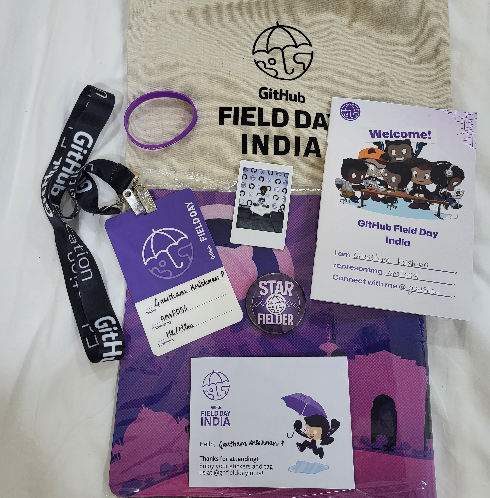

    <figcaption><i>The swags I got from GitHub Field Day. I used the keyboard mat for almost a year, and few of the stickers in the envelope went on my laptop while the rest were given to my friends.</i></figcaption>

The number of courses we must take for our final year is few. We had around 5 courses for our 7th semester, the classes for all of which were scheduled for the afternoon. This was also the time when I joined as a full-time intern at EUSML. The schedule was hectic, with morning gym sessions, lab after that, classes after lunch, and lab again in the evening. This led to a very locked-in and motivated few months. There were a lot of improvements in my skills and health during this period.

The atmosphere among my batchmates was also noticeably different this year. The fact that college was coming to an end seemed to be at the back of everybody’s mind. People were more mindful of cherishing the moments they spent together while juggling between the campus placements[3] and final year project preparations. Most of my batchmates depended on placements for a job, while some started searching for opportunities on their own, and not landing an offer resulted in a stressful time for several of them.

My project mate and I opted out of placements as we wanted to focus completely on EUSML for the year. This shielded(or delayed) us from a lot of placement and job-hunting shenanigans.  

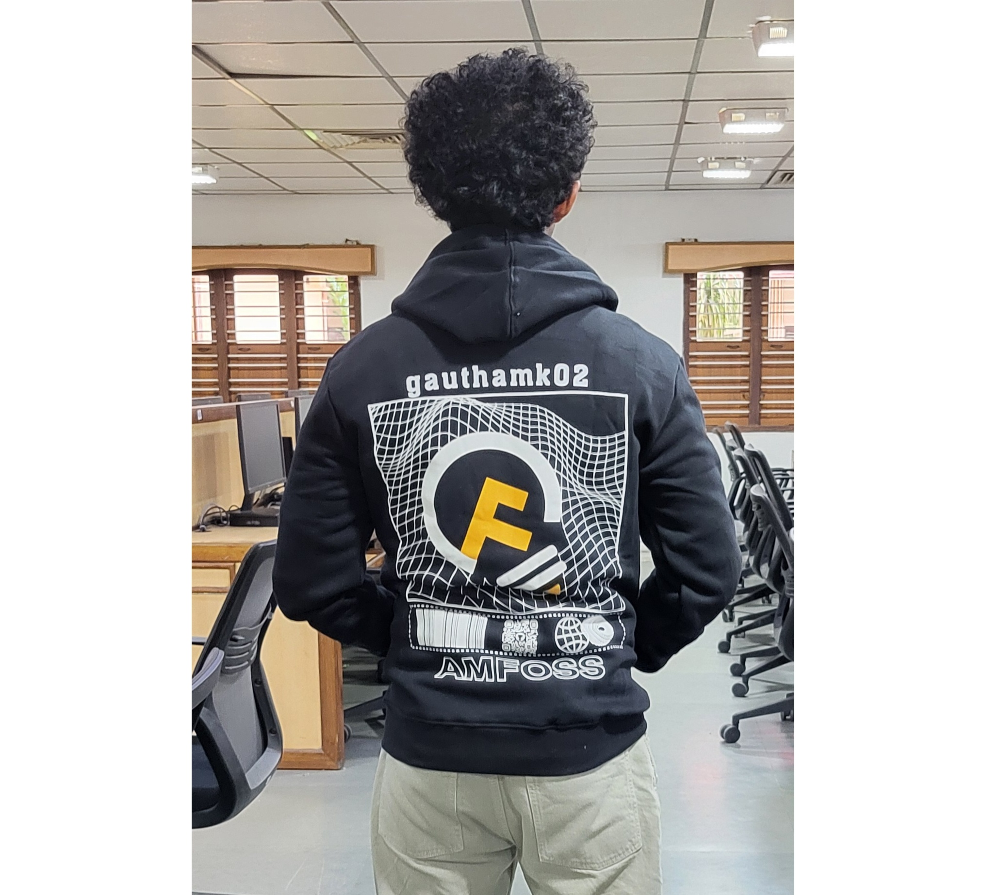 

    <figcaption><i>The amFOSS hoodie that we got after three years of repeated design, approval and failed print orders.</i></figcaption>

 

The last semester had no courses and was just the final year project. My batchmates moved off campus for their internships or went back home. Me, my team members, and a few others stayed back on the campus for project or work-related reasons. For the next many months, we all mostly hung out together. Me and my project mate moved out of the hostel and rented a room, and bought a scooter. This meant we were no longer restricted to the hostel timings. The convenience of having a vehicle and the lack of hostel restrictions saw us exploring a lot of the surrounding places and doing late-night drives. Also, after a long break from swimming, I took it up again at the ashram pool.

The mornings were spent in the lab working on EUSML and a few other Medical AI projects. During this period, we began drafting a research paper, which involved reviewing numerous published studies, experimenting with diverse approaches, and conducting intensive brainstorming sessions to discover innovative ways to enhance current techniques. The process was both tiring and rewarding at the same time. We were able to successfully apply a few methods in related fields after a few modifications to our problem statement — this was a first for the data modality we were working with, and validated its working using multiple metrics.

In this time, my daily interactions were limited to a few people in the office and others from my batch who stayed back. Spending this much time with a limited set of people makes you notice aspects about them that are otherwise not as prominent in a larger group. We were all good friends throughout almost the entire degree. However, being in such close proximity to each other while having fuzzy boundaries separating professional and friendly relationships influenced our dynamics in many subtle ways.

The remainder of the year revolved around the office, gym, hobbies and the hangouts or trips with friends who visited the campus. Over time, I also bonded more with the folks at my office. They were a bunch of interesting people with a variety of passions. Talking about random trivia, movie details and other obsessions became a pastime when not working. 

The convocation ceremony in August brought together most of our batch for what felt like a final reunion. My batchmates had already moved on with their lives — some settling into new jobs, others deep into internships, and many navigating higher studies applications. The conversations now revolved around catching up on these new chapters, exchanging invitations to visit each other's newly settled cities, and sharing well-wishes for the future. There was an air of excitement and accomplishment among everyone, and I also got to meet the parents of many of my friends for the first time. For me personally, the ceremony felt like more than just receiving a degree — it was the official closure that marked the end of my identity as an undergraduate student and the beginning of whatever comes next.

## Amrita and Amritapuri 

Situated in a small fishing village on the coast of Kerala, with a modest town across the bridge, Amritapuri is not much different from other Kerala villages except for the ashram and college. The ashram attracts visitors and residents from across the globe, while the college draws students from throughout India and beyond. This creates a uniquely diverse environment compared to other Kerala colleges. The exposure gained from interacting with such a varied community is truly remarkable.

However, the college environment also carries significant restrictions. The college has an open campus design spread out over multiple compounds and the students have a strict curfew time to be back in the hostel by. The rules are more draconian for girls, as they must return to their hostels by 5:30 pm, and on weekends, they are only allowed to leave the hostel for two hours. Consequently, the campus becomes largely deserted after classes, save for students with special permission to remain for club activities. Club members receive "staybacks" that allow them to stay on campus beyond curfew.

While having these rules and strict curfews might work in portraying an image of the college and the students that the administration envisions, it also significantly limits the motivated students from developing autonomy and making independent decisions about their time and priorities. There wouldn't be any late-night library sessions or informal study groups and hackathons that often spark the most creative solutions. I believe these factors also directly contribute to the interest for students to join a club instead of sitting in the hostel.

However, the hostels are generally clean and well-maintained. The cases of bullying are also minimal on the campus — the environment is usually safe. The mess food is unappealing and can be made better. While there have been gradual improvements over the years, the quality and taste of mess food continue to be a persistent concern shared by students across all batches.

Many students escape to cities like Trivandrum or Kochi on weekends for entertainment and shopping. The options around the campus for these activities are few. Varkala, with its proximity to the campus, stunning beaches, charming cafes and carefree ambience, is another place that has created unforgettable memories for virtually everyone who has studied on this campus.

On the whole, keeping these restrictions aside, the campus has a lot to offer. If you know what you want and are willing to get out of your comfort zone to meet new people, you will find a community that you can be part of that’ll help you in your journey. The place and college can be transformative if you're willing to put in the effort. The college also fosters an atmosphere that encourages learning. Faculty members are also generally approachable, creating many opportunities for deeper academic involvement.

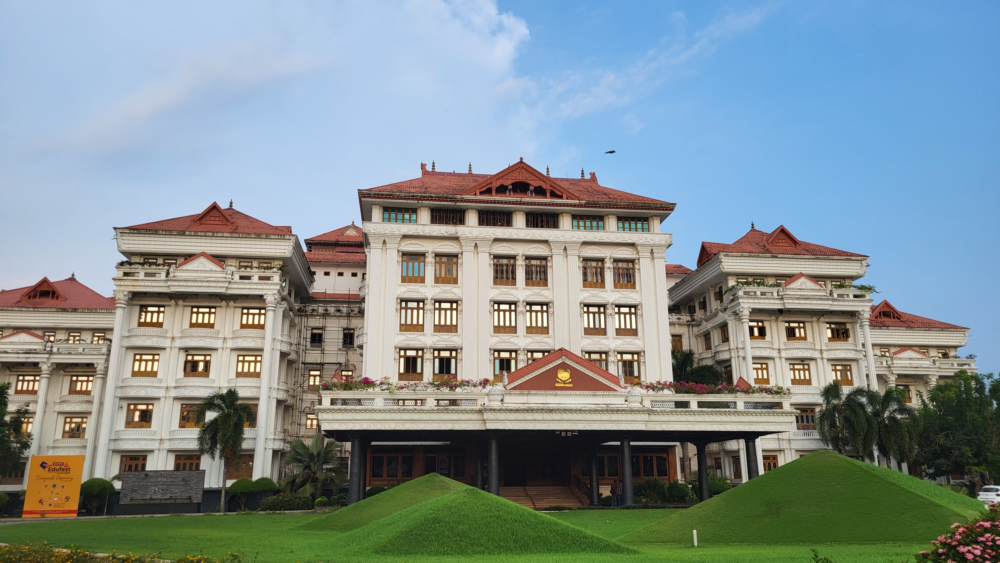

    <figcaption><i>Main campus building of Amrita Vishwa Vidyapeetham, Amritapuri Campus</i></figcaption>

<!-- 
 -->

## amFOSS

What began in 2007 as a small group gathering to participate in competitions has evolved into amFOSS, a prominent college computer science club that has shaped countless students into accomplished developers and researchers. While sharing similarities with other college tech clubs, what truly distinguishes amFOSS, along with its sister club bi0s, is the extraordinary commitment and continuous progress it demands from its members. This attracts some of the most motivated and ambitious students on campus. Perhaps the club's greatest achievement is bringing together such talented individuals and giving them compelling reasons to collaborate.

Beyond the technical growth and opportunities, these clubs become the foundation for some of the most meaningful relationships the members form in college. The shared late nights debugging code, the collective excitement over breakthrough moments, and the mutual support through challenging projects create bonds that go far. When you're working intensively alongside people who share your curiosities and ambitions, you develop a unique understanding of each other's thinking processes and motivations. These connections often evolve into lifelong friendships built on genuine respect and shared experiences. Many of the people I met through amFOSS became not just collaborators on projects, but also close friends who truly understood the unique challenges and motivations that drove me.

On the flip side, the members often sacrifice health and sleep, investing countless hours learning and building, which frequently leads to burnout. These burnouts and unhealthy work obsessions are normalised and justified as motivation or as part of the responsibility of being a club member. Personally, this intense environment accelerated my technical growth to where I am today. However, members often forget that it's ultimately just a club and mistakenly sacrifice other aspects of their lives for it. The output of the club and its members is also not consistent. There were years without any competition wins or notable achievements from its members and years that saw successive wins and members earning recognition through various programs. These highs and lows significantly influence the morals of its members, leading to many of them losing interest in the club. I should also emphasise that these clubs aren't immune to typical organisational politics, nor do all people you meet through the club necessarily have your best interests at heart. It remains crucial to carefully consider the responsibilities one takes while also balancing one's personal development and goals.

amFOSS, along with bi0s, are, in my opinion, some of the best things that a student can be part of on this campus. Passion is contagious, and being surrounded by a diverse group of optimistic people who are excited about the work they do will inspire you to work hard. Beyond the inspiration, these groups provide exposure in terms of knowledge of the opportunities, access to people who can review your work and share their experience, and connections that accelerate your learning curve. Being in such environments means, many times, you do not have to start from scratch if you want to try something out. You will know people who have walked the same path who are willing to share their learnings and guide you, which allows one to avoid many of the mistakes and set oneself many steps ahead.

    <figcaption><i>amFOSS group pic from amFoss-bi0s night 2022</i></figcaption>

<!-- 
 -->

## The Next Step

What the future holds looks extremely promising. The world is advancing at an unprecedented rate, with major discoveries taking place in multiple fields[4]. Humanity as a species seems to be converging to take a position for the next big leap. This technological acceleration is being driven not just by large institutions but by countless passionate individuals — tinkerers, builders, hobbyists, and creators who radiate passion for what they do. 

College gave me a taste of the energy and enthusiasm that one gets by working alongside such like-minded individuals. Now, as I step out into the wider world, I look forward to finding more people who share the creative spirit and build and do amazing stuff with them. Additionally, being in tech allows me to be able to contribute to any domain and help accelerate the progress of development.

There are a lot of uncertainties ahead, yet I find myself genuinely excited for this change in environment and the new responsibilities that come with leaving the college bubble. I used to worry about what I would be doing after college, but as time went on, I’ve realised that things generally work out well. Just not the way you planned or intended to. My freshman and sophomore years of college saw me making elaborate mind maps of accomplishments and achievements I had to get every year, and I was filled with a constant fear of falling short of fulfilling them. 

Later on, I became more comfortable with things not going the way I planned, and the current general attitude can be described as “trust the process”. This is not to say that I am any less ambitious, but rather that I've learned to channel that ambition more sustainably, with less anxiety when plans inevitably shift and more trust in my ability to adapt. This transition wasn't easy or immediate, but it feels far more sustainable and allows me to appreciate the serendipity of how things unfold.

<blockquote class="twitter-tweet">
Good morning <a href="https://t.co/knDPd8jp2w">pic.twitter.com/knDPd8jp2w</a>
&mdash; Space Koala (@culpable_mink) <a href="https://twitter.com/culpable_mink/status/1796551075870498827?ref_src=twsrc%5Etfw">May 31, 2024</a></blockquote> 

<!-- 
 -->

## Wrapping up

As I am writing this section, I am, in many aspects, at a place that would make my teenage self proud and happy. I am extremely grateful for the way the events have unfolded over the past four years, which have influenced me to become the person I am now. I am wiser, more content, more appreciative and have a lot of excitement for what's coming next. Looking back, there are moments where I wish I had taken different paths, made different choices — but these very experiences, including the missteps, have been essential to my growth. The wisdom I've gained through challenges might have made certain periods easier had I possessed it earlier, but there's beauty in the journey of discovery itself.

In retrospect, I also wish I had said yes to a greater variety of things and not restricted myself to the narrow perception I had of myself. I realise how many experiences and personal connections I might have missed because they didn't align with who I thought I was or what I thought I should be doing. I should also acknowledge the serendipity of the situations that led to some of the most influential experiences and events in college.

If you made it this far, I thank you for your patience and appreciate your effort for taking the time to read this. It really means a lot\!

I have so much gratitude for the people I met over the last four years. Everyone who inspired and challenged me, who shared late-night conversations and celebrated small victories, who offered guidance when I was lost and patience when I was stubborn, thank you. To my mentors and those who pushed me out of my comfort zone in ways I didn't initially appreciate, and to everyone else I encountered along the way, classmates in everyday moments, seniors who shared quick words of wisdom, juniors who brought fresh perspectives and energy, and countless others whose brief interactions taught me something valuable. 

Each conversation, however short, contributed to who I am today. I carry forward not just the lessons learned, but the gratitude for knowing that knowledge and wisdom can come from the most unexpected encounters.

I also want to acknowledge the countless creative individuals I've encountered online throughout these years. From developers sharing their unique projects to writers crafting thoughtful reflections and artists displaying their creations, these internet strangers became unexpected sources of motivation. Their willingness to share their work and perspectives pushed me to think differently, develop my own taste, and pursue approaches that felt authentically mine.

Thank you again for reading this and being part of this journey.

നന്ദി, വിട.

Thanks to Aswin, Sreenandana, Farzana, Kailas, Aiswarya, Rajgopalan, Anshuman and Pakhi for reading the drafts and providing ideas; the blog is much more beautiful with your contributions

## Footnotes

[1] A highly competitive entrance examination for admission to India's top engineering colleges, such as Indian Institutes of Technology (IITs), with acceptance rates typically below 2%.

[2] Seva refers to acts of selfless service, often performed with religious intent, and is considered a form of worship. Pilgrims, devotees at temples and holy places, as well as residents of ashrams like Amritapuri, regularly engage in seva activities.

[3] Campus placements refer to the recruitment process where companies visit college campuses to hire final-year students directly. This system is mostly prevalent in Indian universities, where students can secure job offers months before graduation through on-campus interviews and selection processes conducted by the college's placement team. Students can choose to "opt out" if they prefer to find jobs independently or pursue other paths like higher studies or entrepreneurship.

[4] Some of the advancements I can think of at the time of writing are:

- Space Exploration: [Starship Development](https://www.spacex.com/vehicles/starship/), [Ingenutiy Mission](https://science.nasa.gov/mission/mars-2020-perseverance/ingenuity-mars-helicopter/)
- Nuclear Fusion: [Sustained Nuclear Fusion](https://www.advancedsciencenews.com/french-west-reactor-breaks-record-in-nuclear-fusion/), [Net Positive Output](https://www.theguardian.com/environment/2023/aug/06/us-scientists-achieve-net-energy-gain-second-time-fusion-reaction)
- Artificial Intelligence: [Alpha Fold](https://deepmind.google/science/alphafold/), [GPT o3](https://openai.com/index/introducing-o3-and-o4-mini/)
