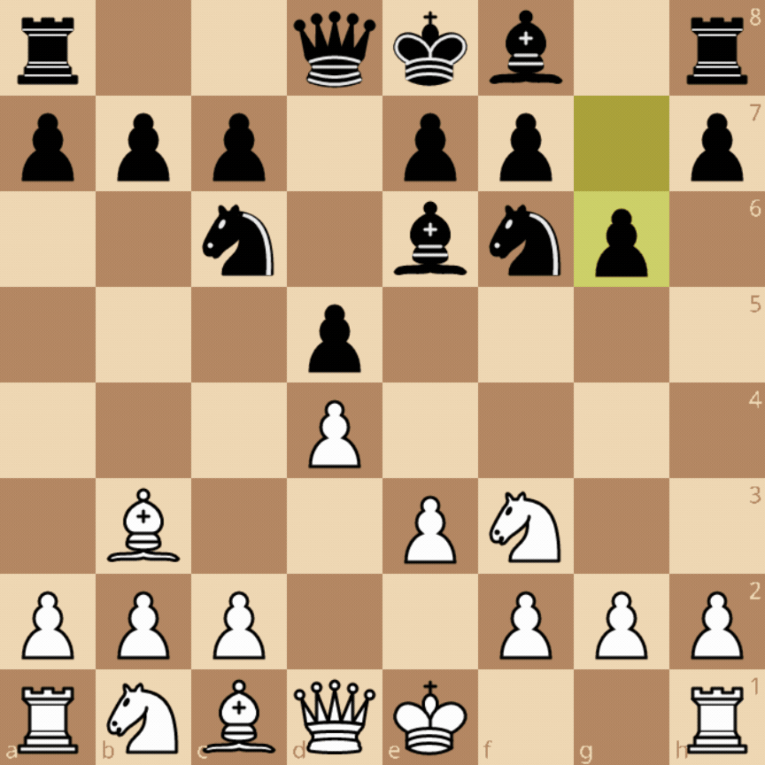
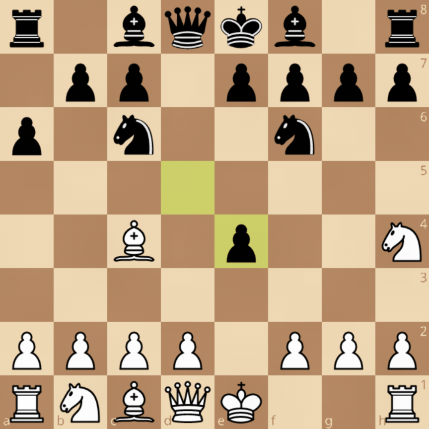

Playing a move in chess means moving one of the pieces on the board to another square according to the rules. Simple enough. Most of the time, you look at the current state, decide the best move, and play it. This means you can predict the next state of the system solely from the current state, without needing the history of previous moves.

However, if we define the state as only the board configuration, chess is not Markovian due to some special rules of the game. In this blog, we will see the rules that prevent the game from being a Markovian process using just the board state and how to modify the state space to make it Markovian. Before we start with that, it would be helpful to go into some more detail on what the Markov process is.

## **Markov Process**

In probability theory, a Markov process is a stochastic system that evolves over time where the next state depends only on the current state. This “memoryless” property is what distinguishes it from more general processes that depend on the full history. In other words, the current state carries all the information needed to determine what happens next. Such systems can be modelled as a sequence of transitions called Markov Chains.

To make this more precise, we can formalize the idea using a discrete-time Markov chain. A discrete-time Markov chain is a sequence of random variables \\(\\{X_t\\}_{t \geq 0}\\) representing the state of a system at time \\(t\\), taking values in a state space \\(S\\). It satisfies the Markov property:

$$
P(X_{t+1} = x \mid X_t, X_{t-1}, \dots, X_0)
= P(X_{t+1} = x \mid X_t).
$$

This means that the probability of transitioning to the next state \\(x\\) depends only on the current state \\(X_t\\), not on the sequence of past states. 


Even systems that are not completely stateless can be modelled as a Markov process. A simple example would be a weather prediction algorithm that predicts tomorrow's weather based on today's weather. To model it as a Markov process, let's take two states of weather, sunny (S) and rainy (R). We assume that tomorrow's weather depends only on today's weather, so we can write the transition probabilities as:

* P(S → S) \= 0.8, if it's sunny today, 80% chance it's sunny tomorrow  
* P(S → R) \= 0.2, if it's sunny today, 20% chance it's rainy tomorrow  
* P(R → S) \= 0.4, if it's rainy today, 40% chance it's sunny tomorrow  
* P(R → R) \= 0.6, if it's rainy today, 60% chance it's rainy tomorrow

So in this model of weather prediction, if today is sunny, we can predict tomorrow's weather using only that fact. We don't need to know whether yesterday was sunny or rainy or what the weather was last week. The current state carries all the information needed. This is the Markov property.

## **Why is Chess not Markovian**

If the rules of Chess were restricted to just the moves each piece can take, the game would be Markovian. However, there are few extra rules in Chess which depend on the history of the moves played and not just the current state. They are:

1. **Castling:** The king moves two squares toward a rook, and the rook is placed on the square next to the king on the opposite side. But to be able to castle neither the king nor the castling rook should have been moved from their original places. Also none of the squares through which the king moves should be attacked. This means having to maintain history of if the King or Rook had moved in the past to check if Castling is a valid move \- hence the game needs additional information other than just the current state.  



2. **En-passant:** If a pawn advances two squares from its starting rank and lands beside an opposing pawn, in the following step, the opposing pawn can diagonally move to the square skipped by the other pawn and capture it. This move requires knowing if the pawn reached the position using double move or a single move to know if en-passant is a valid move which can't be inferred from the current state alone.  



3. **Fifty-move rule:** Either player may claim a draw if no pawn move or capture occurs for 50 consecutive moves in the game.  
4. **Draw by Threefold repetition:** If the same position(including piece placement, side to move, castling rights and en-passant availability) occurs on the board thrice, the players can claim draw. The positions do not have to be consecutive and can occur at any point in the game’s history. This rule exists to prevent [perpetual check](https://www.chess.com/terms/perpetual-check-chess) loops to avoid situations like [this](https://www.chessvariants.com/d.chess/eternal.gif). To enforce this rule all the past states of the game will have to be stored.

## **How to make Chess Markovian**

The easiest way to make the game Markovian is to augment the state variables along with the current board state so that the above rules can be incorporated without explicit history look up. State augmentation is a common practice in Game modelling for simulations, Environment modelling for RL and existing Chess engines do include different state augmentation techniques. However, state space augmentation comes at the cost of added complexity in terms of state representation and computation. Some of the naive methods for state augmentation for the above rules and some other existing methods employed for it are listed below:

1. For Castling, each King and Rook can have an attached state variable \- moved(M). This will allow checking the validity of castling by just looking at the current state.  
2. Similarly for en-passant, we can have a variable storing the value of the square to which en-passant is legal. Since en-passant can only be done on the immediately following move, there will only be one valid square for en-passant.  
3. A Counter variable that stores the number of moves played that resets every time there is a pawn move or capture.

Notations like [FEN](https://en.wikipedia.org/wiki/Forsyth%E2%80%93Edwards_Notation) which represents the position of the chessboard and is used in engines like stockfish have dedicated placeholders variable for representing the above three.

```
rnbqkbnr/pp1ppppp/8/2p5/4P3/8/PPPP1PPP/RNBQKBNR w KQkq c6 0 2
```

An example of an FEN notation. Here `KQkq` shows that both white and black has king's and queen's side castling available. `c6` is the square over which a pawn did the double push and can be used for en-passant capture. `0` is the half move clock, which increments on every play and resets if there is a pawn move of capture. Either player can claim a draw if it reaches 100 — 50 moves for each player. `w` denotes its white turn to play.

4. To hold the necessary information for enforcing the Draw by Threefold repetition rule in a state variable would be the hardest among all the state augmentations given here and would shoot up the complexity of the system we are proposing to make the game Markovian. To represent this in a state variable, we can have a hashmap(or dictionary) type that has all the previous states as the key and how many times it occurred as the value or iterable list that stores all the previous states. It could also be argued that this makes the state effectively unbounded, since it stores the entire history in a compressed form, and therefore is not truly Markovian in a strict sense. However, enforcing the Threefold repetition rule requires all the past positions and we can't get around it.

Stockfish also does essentially the same with a lot of optimizations. It stores the past states in a list instead of a dictionary and each state object has a repetition counter. Feel free to look at the source code for some of the relevant classes and functions to understand its implementation.

* [StateInfo](https://github.com/official-stockfish/Stockfish/blob/bb4eb04a50244442f2925f6dad3b1b2fb1f82236/src/position.h#L44)  
* [Position class](https://github.com/official-stockfish/Stockfish/blob/bb4eb04a50244442f2925f6dad3b1b2fb1f82236/src/position.h#L85)  
* [Position::is\_repetition](https://github.com/official-stockfish/Stockfish/blob/bb4eb04a50244442f2925f6dad3b1b2fb1f82236/src/position.cpp#L1549)

## **Minimal Markov State Representation for Chess**

So to model Chess as a Markov process, we would need the following information in the state space:

* Board configuration  
* Side to move  
* Castling rights  
* En-passant target square  
* Half-move clock  
* Repetition tracking structure

So using these rules Chess can be modelled as a Markovian process, however the information required about the history is stored in a distilled way in the state variables. Chess engines like AlphaZero also model the state space in a way that encodes a limited window of past states, which helps approximate the missing historical information without explicitly storing the full history. In this sense, Chess is not inherently Markovian, but it can be made Markovian through an appropriate choice of state representation. This highlights a broader idea in modelling complex systems, whether a system is Markovian often depends less on the system itself, and more on how we choose to represent its state.

